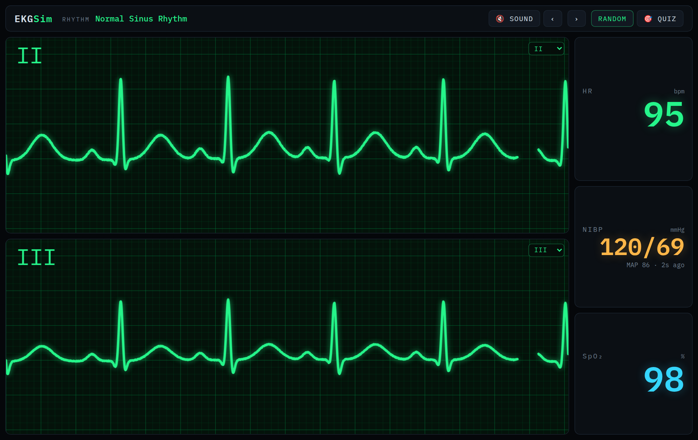
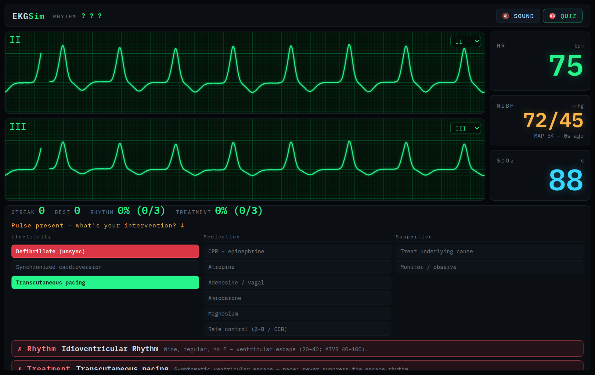
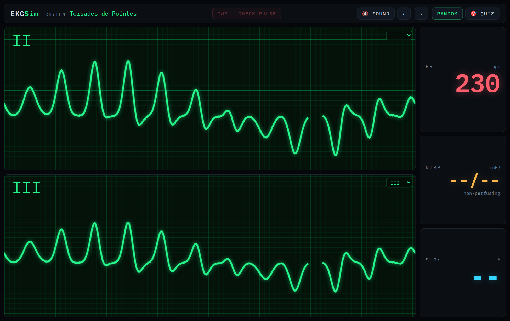

# EKGSim

A calibrated, browser-based **cardiac monitor and dysrhythmia trainer** for
paramedic / ACLS practice. It renders physiologically-shaped ECG waveforms on a
real monitor grid, plays a library of 18 rhythms that are never quite the same
twice, and includes a two-step practice mode: **name the rhythm, then choose the
ACLS intervention** for the patient in front of you. A defibrillator panel lets
you actually run the charge/SYNC/shock sequence against whatever's on the
monitor, and a built-in reference panel covers the algorithms worth reading
before you practice.

Zero build step — just static files (ES modules + Canvas). Serve the folder and
open it.

> ⚠️ **Training and education only.** EKGSim is a simulator for learning rhythm
> recognition and ACLS decision-making. It is **not a medical device** and must
> never be used for real patient care, diagnosis, or treatment decisions.



---

## Quick start

Requires Python 3 (or any static file server). ES modules must be served over
`http://` — opening `index.html` directly via `file://` will not load.

```bash
git clone https://github.com/aschanken/EKGSim.git
cd EKGSim
python3 -m http.server 8137
# open http://localhost:8137/
```

Any static server works equally well (`npx serve`, nginx, etc.). There is
nothing to compile or install.

---

## What it does

### The monitor

- **Two waveform lanes**, each with a selectable lead (I, II, III, aVR, aVL,
  aVF, MCL1). Both lanes observe the same heartbeat from different angles.
- **Calibrated to the real ECG standard**: 25 mm/s sweep, 10 mm/mV gain, a true
  1 mm / 5 mm grid, and the classic left-to-right sweep with a bright erase bar.
- **Live vitals**: heart rate derived from the *actual* R-R intervals (so an
  irregular rhythm reports an irregular rate for free), NIBP with press-to-
  recycle, and SpO₂. Blood pressure is coupled to the rate — a fast rhythm
  reads a softer pressure than a slow one.
- **Audible QRS tone** (Web Audio) whose pitch tracks SpO₂, like a real bedside
  monitor. Off until you toggle it (browser autoplay policy).
- **Alarms**: a critical/warning banner and red HR readout — `CHECK PULSE` for
  non-perfusing rhythms, `UNSTABLE` for critical ones, plus brady/tachy warnings.
- **Procedural variety**: every rhythm self-randomizes its rate, morphology, and
  timing within physiologic bounds, so no two playbacks are byte-identical —
  bounded and realistic, never open-ended noise.

### Browsing rhythms

Use `‹ › ` to step through the library, `RANDOM` for a random pick, or deep-link
a specific rhythm with a URL hash, e.g. `…/#torsades` or `…/#chb`.

### Practice mode (`🎯 QUIZ`)

Endless practice with a two-step round:

1. **Identify the rhythm** — the name is hidden (`? ? ?`) and stripped from the
   alarm banner so nothing gives it away. Pick from the full library, grouped by
   diagnostic family.
2. **Choose the intervention** — each round draws a clinical *scenario* (pulse
   present? stable or unstable?) that **varies** for pulse-dependent rhythms and
   overlays matching vitals on the monitor. Pulse status is stated (it's an exam
   finding the ECG can't show); **stability you read off the displayed BP** —
   that inference is the skill under test.

Both steps reveal immediately with a rationale. Scoring tracks **rhythm
accuracy, treatment accuracy, and a streak** of rounds where both were right.



The same tracing gets different answers depending on the patient. VT alone can
be:

| Scenario | Correct intervention |
|---|---|
| Pulseless | Defibrillate |
| With a pulse, unstable | Synchronized cardioversion |
| With a pulse, stable | Amiodarone |

Answers stay at the **decision level** (defibrillate vs. synchronized
cardioversion vs. pace vs. drug vs. treat-the-cause) — never doses or joules,
which vary by protocol edition and medical direction.

---

## Rhythm library (18)

| Family | Rhythms |
|---|---|
| **Sinus** | Normal Sinus Rhythm, Sinus Bradycardia, Sinus Tachycardia |
| **Atrial** | Atrial Fibrillation (RVR / controlled / slow), Atrial Flutter, SVT |
| **AV Block** | 1° AV Block, Mobitz I (Wenckebach), Mobitz II, 3° (Complete) Block |
| **Junctional** | Junctional Rhythm |
| **Ventricular** | Idioventricular / AIVR, Sinus w/ PVCs, Monomorphic VT, Torsades de Pointes |
| **Arrest** | Ventricular Fibrillation (coarse / fine), Asystole, PEA |

Deep-link ids: `nsr`, `sbrady`, `stach`, `afib`, `aflutter`, `svt`, `avb1`,
`mobitz1`, `mobitz2`, `chb`, `junctional`, `ivr`, `pvc`, `vt`, `torsades`, `vf`,
`asystole`, `pea`.



---

## How it works

The design goal is fidelity without getting lost in the weeds: one shared
cardiac timeline, and each concern isolated so extending the library is a data
change, not an engine change.

- **Beat = sum of Gaussians.** Each P/Q/R/S/T deflection is a Gaussian bump
  (à la the ECGSYN model), so complexes stay smooth at any sample rate.
  → `src/ecg/waveform.js`
- **Leads = per-wave projection coefficients** off the Lead II reference, so a
  12-lead view is a data change rather than an engine rewrite.
  → `src/ecg/leads.js`
- **Rhythm = stateful generator** emitting scheduled beats onto the shared
  timeline; heart rate is measured from the resulting R-R intervals.
  → `src/ecg/rhythm.js`, `src/ecg/rhythms/*.js`
- **Renderer = calibrated sweep** honoring the real mm grid and paper speed.
  → `src/monitor/renderer.js`
- **A shared baseline artifact** (respiratory sway + noise) is computed once per
  timestamp and scaled per lead, so the two lanes read as one patient rather
  than uncorrelated noise.
- **Practice mode** layers a scenario + ACLS-treatment domain on top, with no
  changes to the engine. → `src/quiz/*.js`

### Project layout

```
index.html            monitor + practice-mode markup
styles.css            monitor theme
src/
  main.js             bootstrap: engine, lanes, vitals, audio, alarms, quiz
  ecg/
    waveform.js       Gaussian beat primitives + jitter
    leads.js          per-lead projection coefficients
    rhythm.js         sampling engine (schedules beats, samples any lead)
    rhythms/          one generator per rhythm + the registry (index.js)
  monitor/
    renderer.js       calibrated sweep renderer
    vitals.js         HR / NIBP / SpO2 panel
    audio.js          QRS tone (Web Audio)
  quiz/
    quiz.js           two-step practice controller + scoring
    acls.js           scenario generator + ACLS treatment mapping
scripts/
  summary.mjs         one-line signature for every rhythm (regression check)
  analyze.mjs         detailed observable metrics for a single rhythm
```

---

## Verification

The rhythm engine runs headless under Node, and the harnesses measure
**observable** signal metrics (peak detection, R-R variability, QRS width) rather
than trusting each generator's self-declared values.

```bash
# One-line fingerprint for all 18 rhythms (fast regression check)
node scripts/summary.mjs

# Detailed metrics for a single rhythm over N seconds
node scripts/analyze.mjs src/ecg/rhythms/vt.js createVT 20
```

---

## Controls

| Control | Action |
|---|---|
| `‹` / `›` | Previous / next rhythm |
| `RANDOM` | Random rhythm |
| `🎯 QUIZ` | Toggle practice mode |
| `⚡ DEFIB` | Toggle the defibrillator panel |
| `📖 LEARN` | Toggle the algorithms & reference panel |
| `🔊 SOUND` | Toggle the QRS tone (and audible alarms) |
| Lead dropdown (per lane) | Change which lead that lane shows |
| NIBP panel | Click to recycle (take a fresh cuff reading) |
| URL `#<id>` | Deep-link a specific rhythm on load |

Quiz, Defib, and Learn are mutually exclusive panels — opening one closes the others.

### Defibrillator panel (`⚡ DEFIB`)

Practices the physical sequence, not just the decision: pick an energy level,
toggle `SYNC` on for any rhythm with a pulse (off for pulseless arrest),
`CHARGE`, then `SHOCK`. It's tied to whatever rhythm is live on the monitor
above, and the outcome is simulated, not scripted:

- **Pulseless VF / VT / torsades** → defibrillation "succeeds" (simulated ROSC).
- **Asystole / PEA** → shock is flagged as not indicated; nothing changes.
- **A tachyarrhythmia with a pulse, SYNC on** → cardioversion succeeds.
- **A rhythm with a pulse, SYNC off** → the shock lands on the T wave
  (R-on-T) and the rhythm degenerates into VF — the actual reason SYNC mode
  exists.
- `SYNC` refuses to fire with no organized QRS to lock to, and the unit
  auto-disarms if a charge sits unused, both matching real defibrillator
  behavior.

This is a training interface for the sequence and the physiology, not a
substitute for device-specific training on any real unit.

### Learn panel (`📖 LEARN`)

A short study reference to read before jumping into practice mode: how to
read a strip systematically, the cardiac-arrest and tachycardia/bradycardia
algorithms at decision level, when to defibrillate vs. cardiovert vs. pace
(and why SYNC mode exists), and the H's & T's. It's a refresher, not a
replacement for an ACLS provider course or your local protocols.

---

## Notes & quirks

- **Serve over HTTP.** ES modules won't load from `file://`.
- **Sound starts muted** by design — browsers only allow audio after a user
  gesture, so click `🔊 SOUND` to enable the QRS tone.
- **VF / asystole / PEA / pulseless TdP show no heart rate** (`--`) — these have
  no countable ventricular rate, which is clinically correct.
- **In practice mode the monitor never labels the patient.** The stability /
  perfusion alarms (`UNSTABLE`, `CHECK PULSE`) and the red HR are suppressed —
  only plain rate warnings remain — so nothing hands you the stable-vs-unstable
  call. You read that off the vitals (BP, HR, SpO₂), which is the point.
- Lead projection currently uses a per-wave coefficient table (a faithful
  morphology approximation), not a full cardiac-vector dipole. That's a planned
  upgrade that will not touch the rhythm engine.

---

*Built as a self-contained learning tool. Not for clinical use.*

## Enhanced fork changes — August 2026

This fork includes a clinical/simulation pass based on the 2025 AHA ACLS framework:

- Defibrillator charge audio now terminates cleanly when charging completes, when a shock is delivered, or when the unit is disarmed.
- Added manual **DISARM** control.
- Added independent audio controls for monitor/alarm audio and defibrillator audio.
- Added a transcutaneous pacing simulator with adjustable pacing rate and output, simulated electrical capture, pacing spikes/QRS complexes, and stop/restore behavior.
- Added a `ResizeObserver` so opening the Learn/Quiz/Defib docks resizes the ECG canvas correctly instead of allowing the waveform buffer to overlap the dock.
- Expanded the Learn tab with ACLS decision logic and high-yield edge cases.
- Corrected quiz treatment logic for **AF with slow ventricular response**: AV-nodal rate-control drugs are not the correct generic answer when the ventricular rate is already slow.
- Corrected **sustained polymorphic VT/torsades**: immediate unsynchronized shock is the electrical treatment; magnesium/cause correction is adjunctive for recurrent torsades with prolonged QT.
- Added a 100 J energy preset for synchronized cardioversion scenarios.
- Added teaching notes for pre-excited AF, bradycardia as a clinical diagnosis, and high-grade AV block.

This remains a teaching simulator, not a clinical device or substitute for local protocols, medical direction, or an ACLS course.
